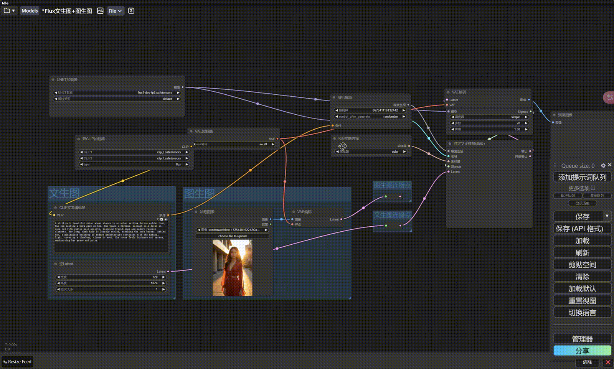

# ComfyUI-NodeAligner

ComfyUI-NodeAligner 是一个轻量级的 ComfyUI 布局插件，包含节点对齐、分布和调整大小等功能。该插件旨在简化可视化节点编辑器或自定义 UI 组件中的布局调整，使节点排列更加方便和高效。

ComfyUI-NodeAligner is a lightweight ComfyUI layout plugin that includes features such as node alignment, distribution, and resizing. This plugin is designed to simplify layout adjustments in visual node editors or custom UI components, making node arrangement more convenient and efficient.

## 功能 Features
- 节点左对齐、右对齐、顶部对齐、底部对齐  
  Align nodes to left, right, top, bottom.
- 水平和垂直居中对齐  
  Center nodes horizontally and vertically.
- 使选中的节点等宽等高  
  Equalize the width and height of selected nodes.
- 水平或垂直均匀分布节点  
  Distribute nodes evenly across horizontal or vertical space.

## 使用方法 Method of Application
1. 选择单个节点，左对齐和顶部对齐会使节点的 `left` 和 `top` 归零。  
   Select a single node; left and top alignment will reset the node's `left` and `top` to zero.

2. 按住 Shift 键或 Ctrl 键，点选多个节点，点击按钮，即可完成对齐和分布。  
   Hold the Shift or Ctrl key, select multiple nodes, and click the button to complete alignment and distribution.

3. 点击空白处取消选择。  
   Click on the blank space to deselect.

4. 如果没选中任何节点的情况下，点击左对齐这画布返回“0、0”坐标。 
   If no nodes are selected, clicking left alignment will return the canvas to "0,0" coordinates.

5. 点中对齐按钮中间的黑色分割线可实现组件的拖拽，进行移动。
   The black division line in the center of the right alignment button allows for component dragging and movement.
     

6. 右键点击本功能栏可选择模式，可选驻留或选中节点后显示。（选择点击>=2个时在鼠标旁显示此功能栏）
   Right-click on this toolbar to choose the mode, with options for either pinning it or showing it after selecting nodes. (When selecting two or more nodes, this toolbar will appear next to the mouse.)

   ps: 按住 Shift 进行拖拽可以对多个选择节点同时进行拖拽。
   ps: Hold Shift to drag and move multiple selected nodes.


视频演示：https://space.bilibili.com/15855661?spm_id_from=333.337.search-card.all.click



## 安装 Installation
1. 克隆仓库：  
   Clone the repository:
   ```bash
   git clone https://github.com/Tenney95/ComfyUI-NodeAligner.git
   ```
2. 将 `ComfyUI-NodeAligner` 文件夹复制到 `ComfyUI/custom_nodes` 目录下。  
